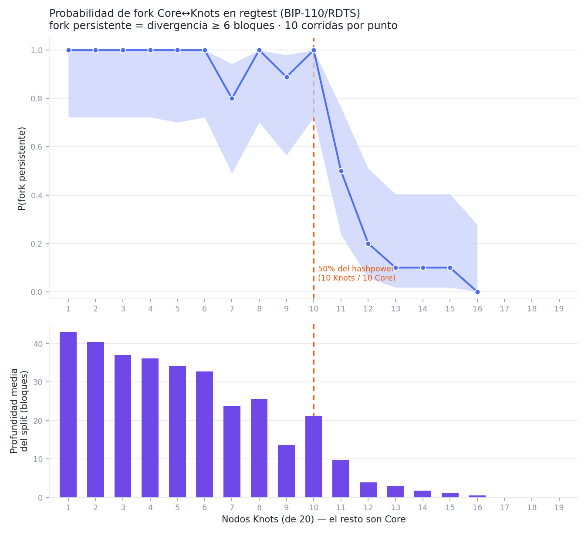

# Simulación de fork Core ↔ Knots (BIP-110 / RDTS) en regtest

**Bitcoin Core 31.1** (no conoce RDTS) vs **Bitcoin Knots v29.3.knots20260508** (aplica el softfork BIP-110/RDTS, forzado activo con `-vbparams=reduced_data:-1:...`).

Modelo: 20 nodos regtest, cada uno = 1/20 del hashpower (minero elegido uniforme por bloque). Cada bloque minado por Core lleva datos que RDTS invalida (OP_RETURN>83 B y/o item de witness>256 B): **válido para Core, rechazado por consenso en Knots** → la cadena se parte.

Un fork se cuenta como **persistente** si al final de la corrida las cadenas Core y Knots divergen ≥ 6 bloques.

## Resultados por proporción

| Knots | Core | Hashpower Knots | Corridas | Forks | P(fork) | IC95% | Prof. media | Softfork gana |
|------:|-----:|:---------------:|:--------:|:-----:|:-------:|:-----:|:-----------:|:----------:|
| 1 | 19 | 5% | 10 | 10 | 100% | [72–100%] | 43.0 | 0 |
| 2 | 18 | 10% | 10 | 10 | 100% | [72–100%] | 40.4 | 0 |
| 3 | 17 | 15% | 10 | 10 | 100% | [72–100%] | 37.0 | 0 |
| 4 | 16 | 20% | 10 | 10 | 100% | [72–100%] | 36.1 | 0 |
| 5 | 15 | 25% | 9 | 9 | 100% | [70–100%] | 34.2 | 0 |
| 6 | 14 | 30% | 10 | 10 | 100% | [72–100%] | 32.7 | 0 |
| 7 | 13 | 35% | 10 | 8 | 80% | [49–94%] | 23.7 | 2 |
| 8 | 12 | 40% | 9 | 9 | 100% | [70–100%] | 25.7 | 0 |
| 9 | 11 | 45% | 9 | 8 | 89% | [56–98%] | 13.7 | 1 |
| 10 | 10 | 50% | 10 | 10 | 100% | [72–100%] | 21.1 | 0 |
| 11 | 9 | 55% | 10 | 5 | 50% | [24–76%] | 9.8 | 5 |
| 12 | 8 | 60% | 10 | 2 | 20% | [6–51%] | 4.0 | 8 |
| 13 | 7 | 65% | 10 | 1 | 10% | [2–40%] | 2.9 | 9 |
| 14 | 6 | 70% | 10 | 1 | 10% | [2–40%] | 1.8 | 9 |
| 15 | 5 | 75% | 10 | 1 | 10% | [2–40%] | 1.2 | 9 |
| 16 | 4 | 80% | 10 | 0 | 0% | [0–28%] | 0.6 | 10 |

## Lectura

- **Cruce de probabilidad** (P baja de 50%) alrededor de **N≈12 nodos Knots**, consistente con la predicción teórica de una carrera de cadena-más-larga con umbral en 50% del hashpower (N=10).
- Con **mayoría Core** (N<10) el softfork **fracasa**: Knots queda aislado en una cadena minoritaria más corta (fork persistente y profundo).
- Con **mayoría Knots** (N>10) el softfork **triunfa**: la cadena limpia es la más larga y Core la adopta reorganizando y descartando sus bloques con datos (fork transitorio o inexistente).
- Verificación estructural: en TODAS las corridas todos los nodos Core coincidieron entre sí y todos los Knots entre sí — el split es por **consenso**, no por conectividad (la malla P2P se mantuvo con `whitelist=noban`).
